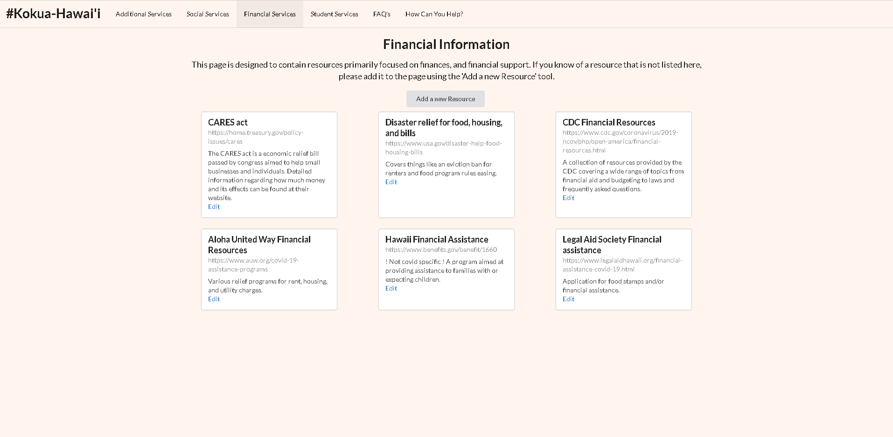
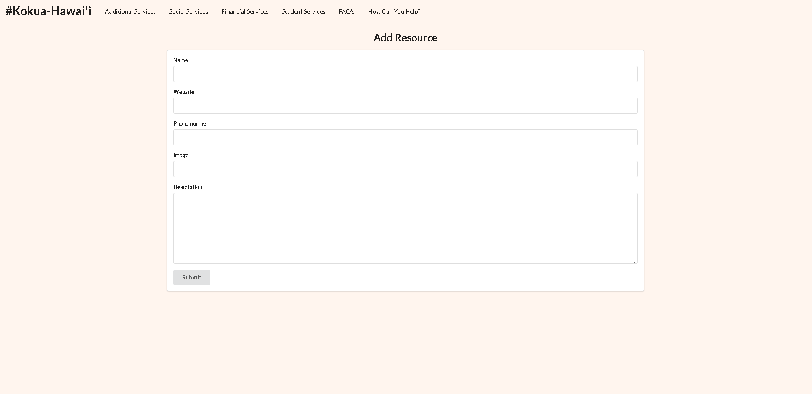
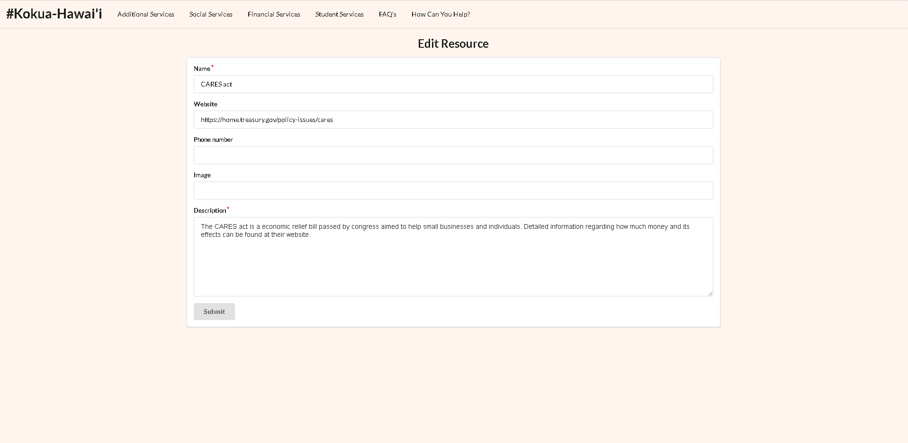

## Table of contents

* [Overview](#overview)
* [Developers](#developers)
* [User Guide](#user-guide)
* [Development History](#development-history)

## Overview
[COVID Kōkua](http://178.128.186.129/#/) is a prototype web application that provides pages to view information regarding COVID-19 resources, including financial, social, and student resources as well as Frequently Asked Questions (FAQs) and links to additional information from official/governmental sources.

A wide array of frameworks and libraries were used in development of COVID Kōkua, including:

* [Meteor](https://www.meteor.com/) for Javascript-based implementation of client and server code.
* [React](https://reactjs.org/) for component-based UI implementation and routing.
* [Semantic UI React](https://react.semantic-ui.com/) CSS Framework for UI design.
* [Uniforms](https://uniforms.tools/) for React and Semantic UI-based form design and display.

## Developers

The following team members contributed to this project as developers:

* Caleb Cheshire [(calebjc3.github.io)](https://calebjc3.github.io/)
* Austin Chong [(austinschong.github.io)](https://austinschong.github.io/)
* Daniel Trupp [(danieltrupp.github.io)](https://danieltrupp.github.io/)
* Liam Tsamous [(ltsamous.github.io)](https://ltsamous.github.io/)

## User Guide

This section provides a walkthrough of the COVID Kōkua user interface and its capabilities.

When users navigate to the COVID Kōkua, website, they will initially begin on the landing page, which looks like this:

Users can go to the site's homepage by scrolling down past the site banner and description and clicking "Let's go to the home page!"

From any page, users are able to navigate via the menu bar at the top of the page. These will link to additional pages for student services, frequently asked questions (FAQs), etc. 

For example, the "Additional Services" page looks like this:

### The Additional Services Page

Users can view information about each service or website in each specific card, and click links which will take them to that website. To visit this page, click [here](http://165.227.22.82/#/additional).

### The Financial Resource Page

This page is organized into cards where each card represents a resource, being either a website or a help line. It looks like this:

Anyone can contribute to the things stored on the page by using the add or edit features. The user interface for both is relatively
simple and displayed below.

### The Social Services Page

This page was designed as a way to connect users to multiple resources dedicated to helping families of Hawai'i. These resources have specific purposes to certain family situations and provides help for issues that pertain to child services, abuse help lines, and other great tools for people who may need the support.

## Development History

The development process for COVID Kōkua conformed to [Issue Driven Project Management](http://courses.ics.hawaii.edu/ics314f19/modules/project-management/) practices. In a nutshell:

* Development consists of a sequence of Milestones.
* Each Milestone is specified as a set of tasks.
* Each task is described using a GitHub Issue, and is assigned to a single developer to complete.
* Tasks should typically consist of work that can be completed in 2-4 days.
* The work for each task is accomplished with a git branch named "issue-XX", where XX is replaced by the issue number.
* When a task is complete, its corresponding issue is closed and its corresponding git branch is merged into master.
* The state (todo, in progress, complete) of each task for a milestone is managed using a GitHub Project Board.

The following sections document the development history of BowFolios.

### Milestone 1: Mockup development

The goal of Milestone 1 was to complete mockups of each page of the application, with the general formatting and structure in place. Minor fixes and aesthetics can be improved at later milestones. To view the Milestone 1 project, click [here](https://github.com/covid-kokua/covid-kokua/projects/1).

### Milestone 2: Data model development

The goal of Milestone 2 is to improve aesthetics and functionality of the draft mockups for the application's pages. Then the team will work on adding potential additional features that could improve capability and user-friendliness. Click [here](https://github.com/covid-kokua/covid-kokua/projects/2) for the Milestone 2 project.

## Milestone 3: Final touches

The goal of Milestone 3...
