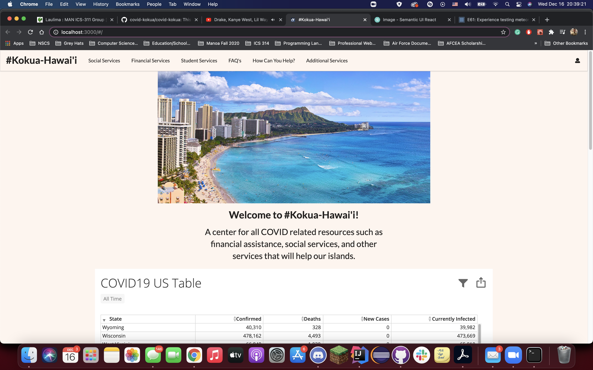

## Table of contents
* [Deployment](#deployment)
* [Overview](#overview)
* [User Guide](#user-guide)
* [Feedback](#feedback)
* [Developer Guide](#developer-guide)
* [Developers](#developers)
* [Development History](#development-history)

## Deployment
Kōkua Hawaiʻi is deployed through Digital Ocean. Click [HERE](http://104.236.11.85) to visit the website!

### Testing Discrepancy
All tests created for the web application pass locally but fail in GitHub. When downloading the application and running "meteor npm run start", it will run smoothly on http://localhost:3000

## Overview
Kōkua Hawaiʻi is a prototype web application that provides pages to view information regarding COVID-19 resources, including financial, social, and student resources as well as Frequently Asked Questions (FAQs) and links to additional information from official/governmental sources.

A wide array of frameworks and libraries were used in development of Kōkua Hawai'i, including:

* [Meteor](https://www.meteor.com/) for Javascript-based implementation of client and server code.
* [React](https://reactjs.org/) for component-based UI implementation and routing.
* [Semantic UI React](https://react.semantic-ui.com/) CSS Framework for UI design.
* [Uniforms](https://uniforms.tools/) for React and Semantic UI-based form design and display.

## User Guide

This section provides a walkthrough of the Kōkua Hawaiʻi user interface and its capabilities.

When users navigate to the Kōkua Hawaiʻi, website, they will initially arrive on the homepage, which looks like this:

Scrolling down, users can see and interact with the embedded COVID case data, which allows them to view pertinent information regarding cases, deaths, etc. in each state.

The homepage concludes with some basic information on navigating the site, which is fairly simple

          
Following that, the next section outlines the mission of our team and website, and provides an example graph of the unemployment situation that we are facing locally.

From any page, users are able to navigate via the menu bar at the top of the page. These will link to additional pages for student services, frequently asked questions (FAQs), etc. 

For example, the "Additional Services" page looks like this:

### The Additional Services Page

Users can view information about each service or website in each specific card, and click links which will take them to that website. To visit this page, click [here](http://165.227.22.82/#/additional).

### The Financial Resource Page

This page is organized into cards where each card represents a resource, being either a website or a help line. It looks like this:

Anyone can contribute to the things stored on the page by using the add or edit features. The user interface for both is relatively
simple and displayed below.

### The Social Services Page

This page was designed as a way to connect users to multiple resources dedicated to helping families of Hawai'i. These resources have specific purposes to certain family situations and provides help for issues that pertain to child services, abuse help lines, and other great tools for people who may need the support. The goal of this page is to present all of the info in a compact fashion so that users can access it quickly without having to sift through lists.

### The Student Services Page

This page gives local students of all University of Hawai'i colleges easy access to the many resources that they provide in order to assist students with the struggles of online learning and COVID-19.

### The FAQ Page

When there are questions that are asked on a consistent basis, we use this page to address those common issues and give resources where applicable.

## Feedback

Listed below is feedback given to us by the community on how to further improve our application:

1. The Home Page image is too large
2. The question mark image is too large
3. There is no space at the bottom of the home page/needs a footer?
4. The navigation question is higher priority than other information on the page, and should be higher up
5. The 'Welcome to #Kokua-Hawai'i' text should be bigger
6. The COVID table needs and explanation
7. Social service page is a lot of text, could use more spacing
8. Financial service page is broken
9. NavBar could be a slightly different color, to be more interesting
10. The header for some pages is too close to the navbar

## Developer Guide

### Download

To develop the system further, you can fork the github repo from [https://github.com/covid-kokua/covid-kokua](https://github.com/covid-kokua/covid-kokua). Once downloaded, it can be locally opened in your development environment of choice.

### Installation and Running

Once downloaded, use a command prompt to enter the app directory of the project and run `meteor npm install`. This will install all the necessary packages for the program. After the install finishes, you can run `meteor npm run start` to run the website. It will create a page at [http://localhost:3000/]( http://localhost:3000/). You can safely ignore the warning about installing bcrypt that appears in the terminal.

### Modifying the system

Once Downloaded and Installed, the program can be modified by altering the files in the app directory. The imports subdirectory contains a user interface subdirectory, where the pages and components of the website are housed. Editing the `settings.json` file allows for the creation of default data. In the case of new publications and collections, the `Mongo.js` and `Publications.js` files in the server directory need to be changed. Further inquiries about the program can be made to the developers.

## Developers

The following team members contributed to this project as developers:

* Caleb Cheshire [(calebjc3.github.io)](https://calebjc3.github.io/)
* Austin Chong [(austinschong.github.io)](https://austinschong.github.io/)
* Daniel Trupp [(danieltrupp.github.io)](https://danieltrupp.github.io/)
* Liam Tsamous [(ltsamous.github.io)](https://ltsamous.github.io/)

## Development History

The development process for Kōkua Hawai'i conformed to [Issue Driven Project Management](http://courses.ics.hawaii.edu/ics314f19/modules/project-management/) practices. In a nutshell:

* Development consists of a sequence of Milestones.
* Each Milestone is specified as a set of tasks.
* Each task is described using a GitHub Issue, and is assigned to a single developer to complete.
* Tasks should typically consist of work that can be completed in 2-4 days.
* The work for each task is accomplished with a git branch named "issue-XX", where XX is replaced by the issue number.
* When a task is complete, its corresponding issue is closed and its corresponding git branch is merged into master.
* The state (todo, in progress, complete) of each task for a milestone is managed using a GitHub Project Board.

The following sections document the development history of BowFolios.

### Milestone 1: Mockup development

The goal of Milestone 1 was to complete mockups of each page of the application, with the general formatting and structure in place. Minor fixes and aesthetics can be improved at later milestones. To view the Milestone 1 project, click [here](https://github.com/covid-kokua/covid-kokua/projects/1).

### Milestone 2: Data model development

The goal of Milestone 2 is to improve aesthetics and functionality of the draft mockups for the application's pages. Then the team will work on adding potential additional features that could improve capability and user-friendliness. Click [here](https://github.com/covid-kokua/covid-kokua/projects/2) for the Milestone 2 project.

## Milestone 3: Final touches

The goal of Milestone 3 is to further improve the aesthetics and capabilities of the application and attempt to incorporate more features for the website. The team will continue to make further improvements where they see fit. Click [here](https://github.com/covid-kokua/covid-kokua/projects/4) for the Milestone 3 project.
